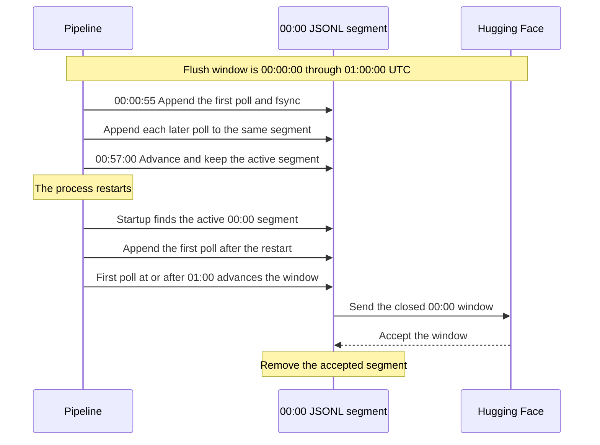

# NEA weather examples

These examples collect weather data from the Singapore NEA API.
They store each accepted poll in a local JSONL segment.
They send closed segments to Hugging Face.

Read this guide before you change a poll interval or a flush policy.
The two values control different clocks.

## Select an example

| Example | Terminal sink | Configuration file |
|---|---|---|
| `nea_weather` | Hugging Face dataset repository | `examples/meathook.toml` |
| `nea_weather_bucket` | Hugging Face storage bucket | `examples/meathook_bucket.toml` |

Both examples use the same collectors and record types.
Both examples put `JsonlStore` directly before the terminal sink.
This layout gives durable custody to each accepted poll.

## Prepare the application

1. Put the spool directory on persistent storage.
2. Set `HF_TOKEN` to a token that has write access.
3. Set `X_API_KEY` if the NEA service requires this key.
4. Edit the applicable configuration file.

Run the dataset example:

```bash
HF_TOKEN=hf_... cargo run --example nea_weather -- examples/meathook.toml
```

Run the bucket example:

```bash
HF_TOKEN=hf_... cargo run --features hf-bucket \
  --example nea_weather_bucket -- examples/meathook_bucket.toml
```

Create the storage bucket before you run the bucket example.

## Understand the two clocks

Do not use `poll interval` and `flush window` as equivalent terms.
They have different functions.

| Clock | Configuration | Function |
|---|---|---|
| Poll clock | `collectors.<name>.interval` | Tells the collector when to make a request. |
| Window clock | `flush.every` | Groups records in UTC wall-clock windows. |

The poll clock starts when the process starts.
The first poll occurs immediately.
The other polls occur after each configured interval.

For example, a one-minute poll interval can have these poll times:

```text
Process start: 00:00:55 UTC
Polls:         00:00:55, 00:01:55, 00:02:55, ...
```

A process restart starts a new poll clock.
It does not continue the phase of the old poll clock.

```text
Process restart: 00:57:00 UTC
Polls:           00:57:00, 00:58:00, 00:59:00, ...
```

The window clock does not depend on the process start time.
It uses UTC boundaries from the Unix epoch.
An hourly policy always uses these windows:

```text
00:00:00–01:00:00 UTC
01:00:00–02:00:00 UTC
02:00:00–03:00:00 UTC
```

The pipeline checks the window clock at startup and before each poll.
This check is `Sink::advance()`.
The check occurs when collection returns no records.
The check also occurs when collection returns an error.

## Understand a restart in an active window

This sequence uses an hourly flush window and a one-minute poll interval.
The application starts at `00:00:55` UTC.
The application stops and restarts at `00:57:00` UTC.



The restart does not make a second segment for the same active window.
The restarted process appends records to the same Unix-timestamp JSONL file.
The tier also restores the persisted record count.
The `max_records` limit continues to use the count from before the restart.

## Understand the delivery time

A UTC boundary closes a window.
The boundary does not start a collector task.
The next lifecycle check sends the closed window.

For a one-minute poll interval, the delivery delay is usually less than one minute.
For a one-hour poll interval, the delay can be much longer.

Use this example:

```text
Poll interval:    1 hour
Process start:    00:00:55 UTC
Process restart:  00:57:00 UTC
Poll after restart: 00:57:00 UTC
Next poll:        01:57:00 UTC
```

The `00:00–01:00` window closes at `01:00:00`.
The pipeline does not have a lifecycle check at that time.
It sends the closed window at `01:57:00` or soon after.

Select a poll interval that is shorter than the flush window.
A shorter interval reduces the delivery delay after a UTC boundary.

The current scheduler does not align polls to UTC boundaries.
It also does not keep a stable poll phase across restarts.
This behavior does not change the UTC identity of a storage window.

## Select a shutdown policy

The examples use `ShutdownPolicy::PreserveActiveWindow`.
On graceful shutdown, this policy sends closed windows only.
It keeps the active window in the JSONL spool.

Use this policy when all active records are in a durable store.
The examples satisfy this requirement because `JsonlStore` is the first tier.

Do not put `MemStore` before `JsonlStore` with this shutdown policy.
An active `MemStore` window does not survive process exit.

`ShutdownPolicy::FlushAll` sends all windows during shutdown.
It also sends the active partial window.
Use this policy when the remote sink must have the current records.

If a preserved process never starts again, its active data stays local.
Before permanent removal, change the policy to `FlushAll`.
Then stop the application gracefully.

## Understand physical files

One UTC window can produce more than one remote file.
This condition occurs when `max_records` sends a partial segment.
This condition also occurs after an explicit force flush.

Remote paths include a content fingerprint.
The fingerprint prevents one physical file from overwriting another file.
A deterministic replay uses the same path.

If Hugging Face rejects a window, `JsonlStore` keeps its segment.
A later lifecycle check tries to send the segment again.

## Inspect the spool

The spool has one directory for each pipeline.
An active hourly window has a file such as this file:

```text
spool-test/air_temperature/1788134400.jsonl
```

The file name is the Unix timestamp for the window start.
Successful delivery removes the applicable segment.
The directory can continue to exist after segment removal.

Use this command to inspect local custody:

```bash
find ./spool-test -type f -name '*.jsonl' -print
```

Do not remove an active or rejected segment unless you accept data loss.

## Configuration example

This configuration polls each minute and makes one-hour UTC windows:

```toml
spool_dir = "/var/lib/meathook/spool"

[flush]
every = "1h"
max_records = 50_000

[sink.huggingface]
repo = "you/weather-data"
branch = "main"

[collectors.air_temperature]
interval = "1m"
```

The flush policy groups records by arrival time.
It does not use a timestamp from the record.
When the source supplies a timestamp, use it as the deduplication key.
